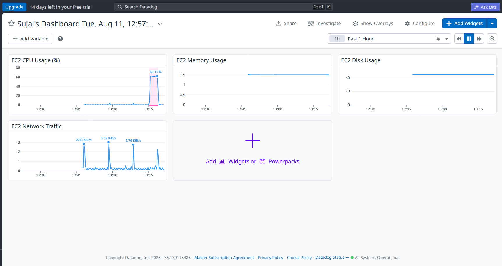
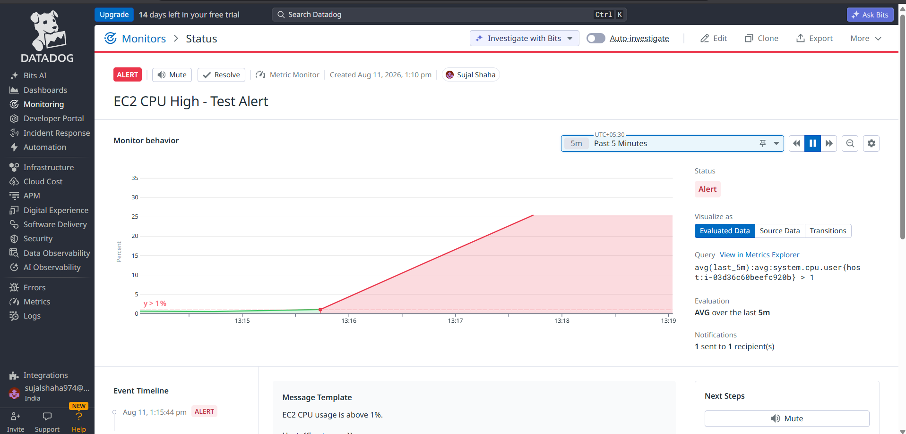

# Cloud Observability & Monitoring Project

## Overview

This project demonstrates hands-on implementation of cloud infrastructure observability using two industry-leading monitoring platforms — **Datadog** and **Splunk** — on an AWS EC2 environment.

The objective was to gain practical experience in setting up real-time infrastructure monitoring, threshold-based alerting, and log-based troubleshooting, using two different but complementary approaches to observability: **metrics-driven monitoring (Datadog)** and **log-driven analysis (Splunk)**.

---

## Repository Structure

```
cloud-observability-monitoring/
├── Datadog/
│   ├── README.md
│   └── Screenshots/
└── Splunk/
    ├── README.md
    └── Screenshots/
```

Each folder is a self-contained sub-project with its own detailed README and supporting screenshots.

---

## Tools & Technologies Used

- **AWS EC2** – target infrastructure being monitored
- **Datadog** – infrastructure metrics, dashboards, monitors, and alerting
- **Splunk Cloud** – log ingestion, search (SPL), and log-based visualization
- **Amazon SSM Agent / syslog** – log and telemetry sources

---

## Project Components

### 1. [Datadog](./Datadog) — Metrics-Based Monitoring

Real-time infrastructure monitoring of an AWS EC2 instance using the Datadog Agent — CPU, memory, disk, and network metrics, a custom dashboard, a threshold-based monitor, and email alerting.

<table>
<tr>
<td></td>
<td></td>
</tr>
<tr>
<td align="center"><sub>Infrastructure Dashboard</sub></td>
<td align="center"><sub>CPU High Alert / Monitor</sub></td>
</tr>
</table>

### 2. [Splunk](./Splunk) — Log-Based Analysis

Log ingestion and analysis of EC2 syslog data using Splunk Cloud — data onboarding, SPL searches for errors, failed services, and out-of-memory events, plus a trend visualization dashboard.

<table>
<tr>
<td></td>
<td></td>
</tr>
<tr>
<td align="center"><sub>Error/Failed Trend Chart</sub></td>
<td align="center"><sub>Failed Events Search</sub></td>
</tr>
</table>

---

## High-Level Workflow

```
AWS EC2 Instance
      │
      ├──► Datadog Agent  ──► Metrics (CPU/Memory/Disk/Network) ──► Dashboard ──► Monitor ──► Email Alert
      │
      └──► Syslog Data    ──► Splunk Cloud (Indexed) ──► SPL Search (error/failed/OOM) ──► Visualization
```

---

## Key Learnings

- Setting up agent-based infrastructure monitoring on AWS EC2
- Building custom real-time dashboards for infra metrics
- Configuring threshold-based monitors and alert notifications
- Log ingestion and onboarding in Splunk Cloud
- Writing SPL (Search Processing Language) queries to detect errors and failures
- Root-cause spotting through log patterns (e.g., OOM killer events, failed systemd services)
- Comparing a metrics-first (Datadog) vs. logs-first (Splunk) approach to observability
