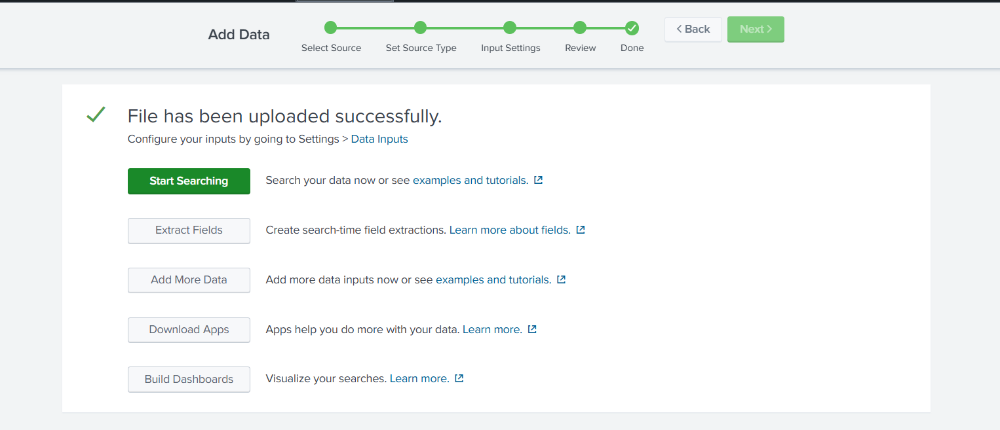
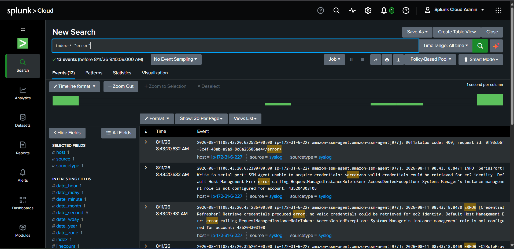
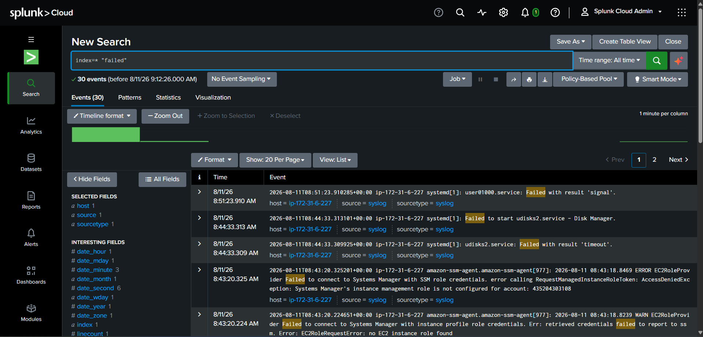
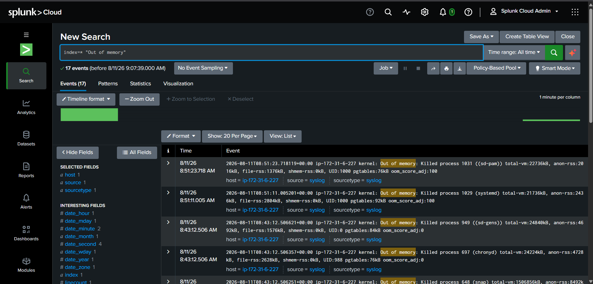
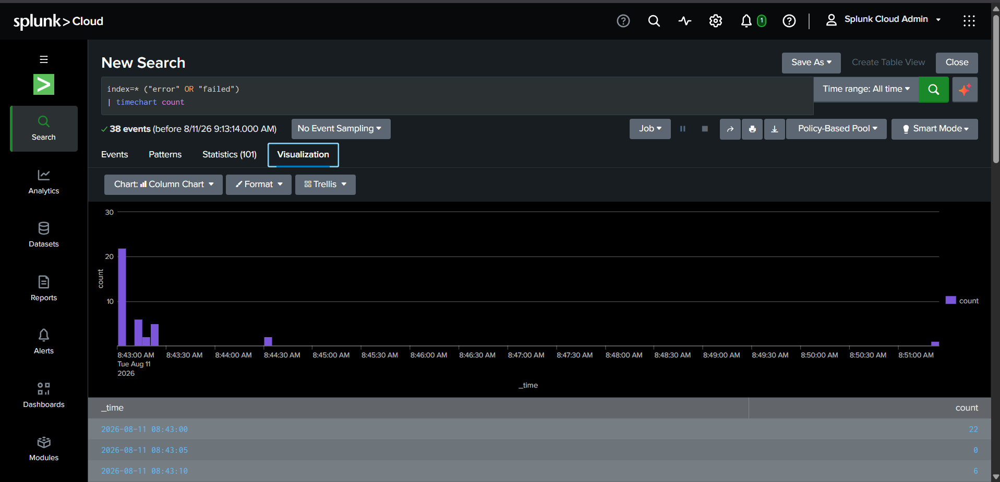

# Splunk – AWS EC2 Log Analysis

## Overview

This module covers setting up **Splunk Cloud** to ingest and analyze system log (syslog) data from an AWS EC2 instance. It demonstrates the full log-analytics workflow: onboarding raw log data, writing SPL (Search Processing Language) queries to surface errors, failed services, and out-of-memory events, and visualizing the results as trend charts.

---

## Tools Used

- Splunk Cloud (Search, Data Onboarding, Visualization)
- AWS EC2 (syslog source: `amazon-ssm-agent`, `kernel`, `systemd`)
- SPL (Search Processing Language)

---

## Project Components

### 1. Data Onboarding

Used Splunk's **Add Data** wizard (Select Source → Set Source Type → Input Settings → Review → Done) to onboard EC2 syslog data into Splunk Cloud. The upload completed successfully, making the log stream searchable via `index=*`.



### 2. Error Log Search

Query:
```
index=* "error"
```
Returned 12 events, primarily `amazon-ssm-agent` credential errors on the EC2 host (`ip-172-31-6-227`) — e.g. `AccessDeniedException: Systems Manager's instance management role is not configured for account`.



### 3. Failed Events Search

Query:
```
index=* "failed"
```
Returned 30 events, including failed `systemd` services (`user@1000.service`, `udisks2.service`) and failed SSM role/credential retrieval attempts — useful for spotting service-level and IAM-role misconfigurations.



### 4. Out-of-Memory Search

Query:
```
index=* "Out of memory"
```
Returned 17 events showing the Linux kernel's **OOM killer** terminating processes (e.g. `sd-pam`, `systemd`, `chronyd`, `snap`) due to memory pressure — a key indicator for diagnosing resource exhaustion on the instance.



### 5. Trend Dashboard / Visualization

Query:
```
index=* ("error" OR "failed") | timechart count
```
Combined error and failure events into a single time-series chart to visualize the frequency and clustering of issues over time, making it easy to correlate spikes in errors/failures with specific events on the host.



---

## Workflow

```
EC2 Syslog Data
        │
Onboarded via "Add Data" Wizard
        │
Indexed in Splunk Cloud
        │
SPL Searches (error / failed / Out of memory)
        │
Timechart Visualization ──► Trend Dashboard
```

---

## Key Learnings

- Onboarding and indexing raw syslog data in Splunk Cloud
- Writing SPL queries to filter and search across log events
- Identifying error and failure patterns from EC2/SSM Agent logs
- Detecting resource exhaustion via kernel OOM killer logs
- Building time-series visualizations (`timechart`) to spot trends in system issues
